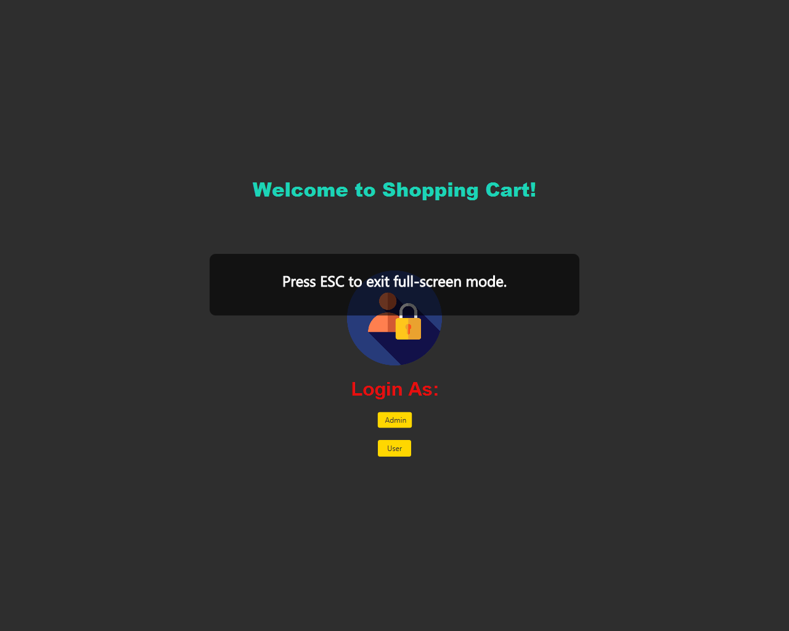
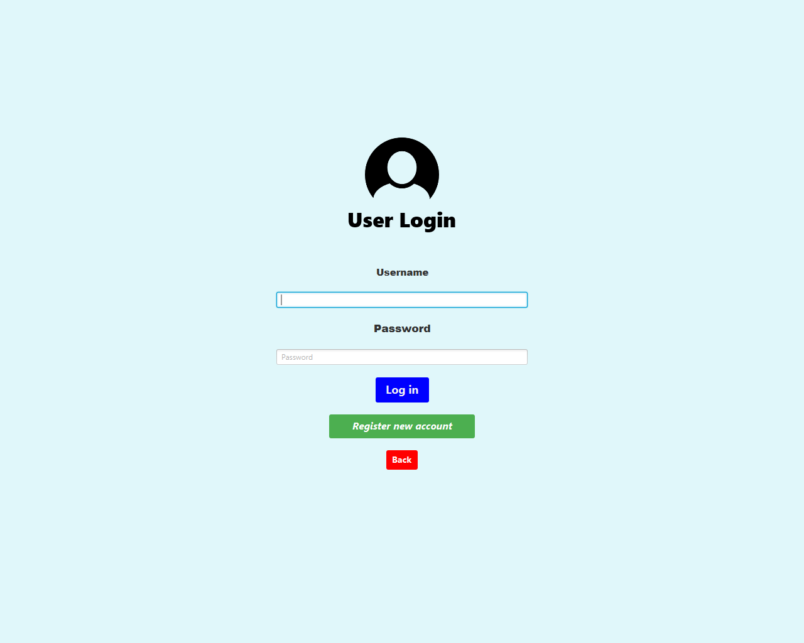
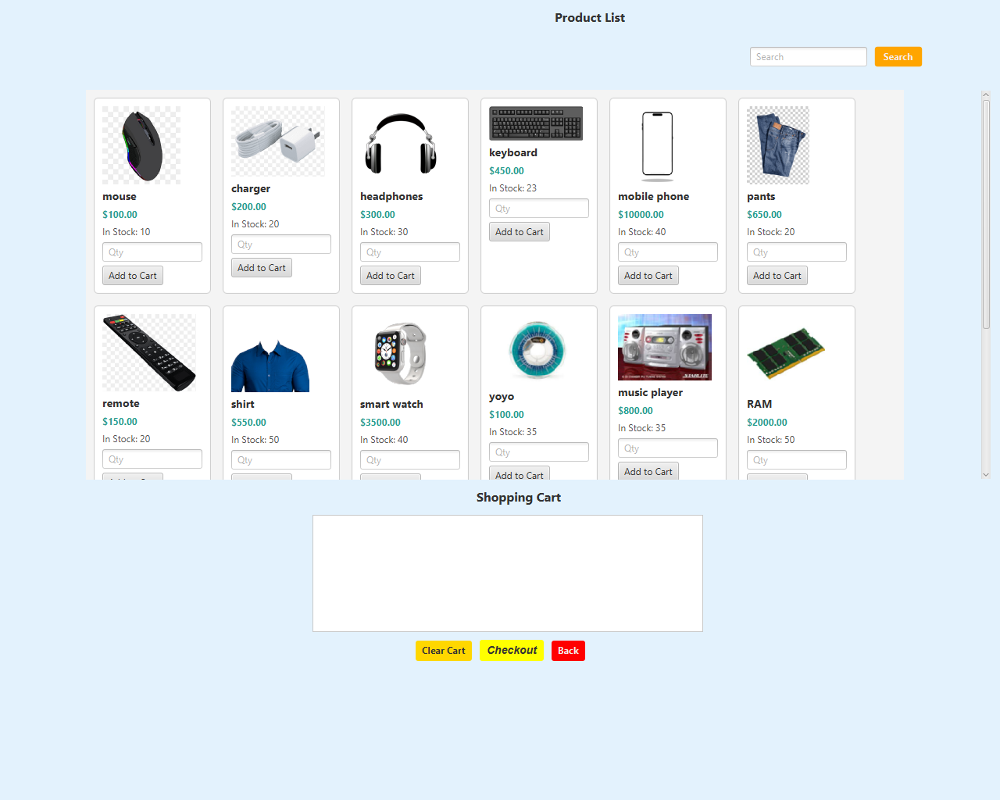
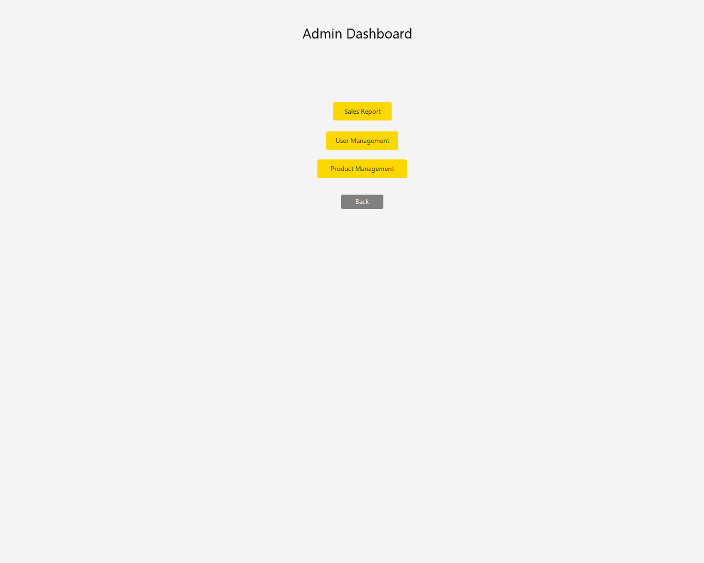
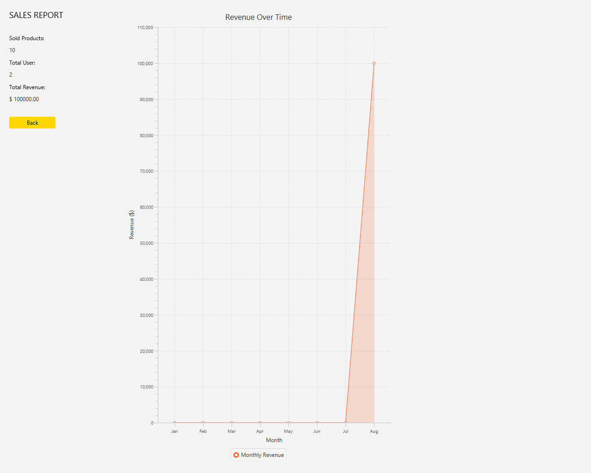
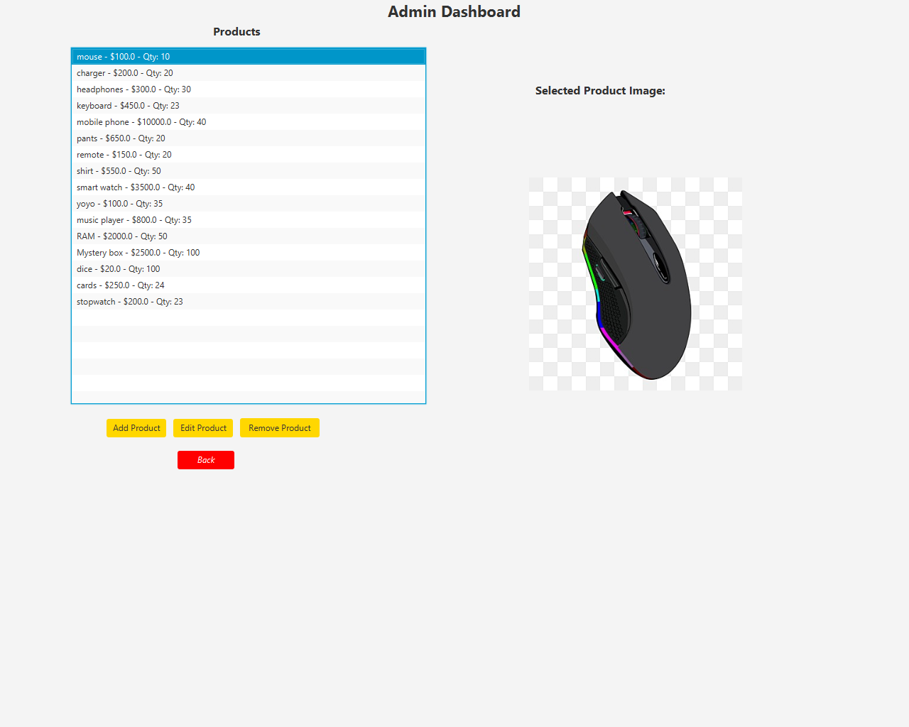
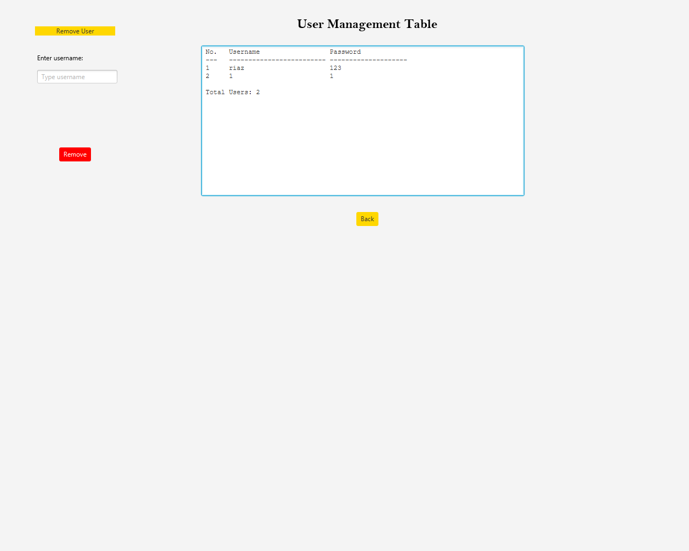

# 🛒 File-Based E-commerce System (Java + JavaFX)

## 📌 About
This is a **shopping cart and e-commerce management system** built using **Java** and **JavaFX**.  
The project simulates a basic e-commerce platform where users and admins can interact with the system through a graphical interface.

---

## ✨ Features
- 👤 **User Login & Registration**
- 🛍️ **Product Management** (Add, update, delete products)
- 📊 **Sales Report**
- 🔑 **Admin Dashboard**
- 🖼️ **JavaFX GUI with FXML**

---

## 🚀 How to Run

### Prerequisites
- Install **Java 17+**
- Install **JavaFX 23+**
- Install **Maven**
- Use an IDE like **IntelliJ IDEA** (recommended)

### Steps
1. Clone the repository:
   ```bash
   git clone https://github.com/riazaslam029/File-Based-E-commerce-System-using-Java-and-JAvaFX.git
2. Open the project in IntelliJ IDEA.

3. Let Maven resolve dependencies automatically.

4. Run the main file:

   HelloApplication.java
   
## 🔧 Tech Stack

Java 17

JavaFX 23

Maven

IntelliJ IDEA

## 📂 Project Structure
```bash
src/main/java/com/example/javafx/
 ├── model/                     # Model classes (business logic)
 ├── controllers/               # JavaFX Controllers
 ├── HelloApplication.java      # Main entry point
 └── ...
src/main/resources/com/example/javafx/
 ├── *.fxml                     # UI Layout files
 └── images/                    # Project assets
```` 

## 🖼️ Screenshots









## Admin Login
Username: admin

Password: 1234

## 👨‍💻 Author
 Riaz Aslam

 GitHub profile: https://github.com/riazaslam029

## 📜 License
This project is licensed under the MIT License – feel free to use and modify!!
